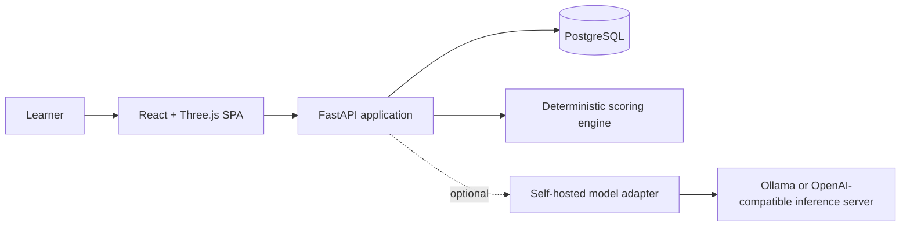

# MedSim target architecture

## Decisions

1. **Outpatient only.** Emergency data is migration input, not a product mode.
2. **Text first.** Remove microphone, speech recognition, speech synthesis,
   LiveKit, and the separate voice worker from the target runtime.
3. **One frontend store.** Preserve the existing singleton store until a
   separately approved state architecture change.
4. **Server-owned identity and records.** PostgreSQL is the production system
   of record; browser storage is a cache.
5. **Deterministic scoring first.** An optional open model explains a score; it
   does not create the authoritative score.
6. **Canonical patient facts.** Model output cannot add or mutate clinical facts.
7. **Version everything used for grading.** Case, rubric, rules, prompt, and
   model identifiers are stored with each attempt.

## Runtime view



The simulator remains usable when `MODEL` is unavailable. Patient answers come
from reviewed case content, and deterministic/template feedback remains visible.

## Bounded contexts

- **Identity:** users, sessions, consent, roles.
- **Catalogue:** specialties, immutable case versions, assets, references.
- **Simulation:** attempts and append-only encounter events.
- **Assessment:** rubric versions, deterministic evidence rules, scores.
- **Narrative:** optional model adapters, prompts, validation, provenance.
- **Governance:** reviews, approvals, source versions, publication gates.

## Persistence model

Minimum tables are `users`, `sessions`, `case_versions`, `rubric_versions`,
`attempts`, `encounter_events`, `evaluations`, `clinical_sources`, and
`clinical_reviews`. An attempt references immutable versions instead of the
latest mutable case row.

Sessions use random opaque tokens. Only a hash is stored server-side; the raw
token is held in a secure, HTTP-only, same-site cookie. Every attempt/evaluation
query includes the authenticated owner. Administrative publication and model
configuration routes require a distinct role and are never authorized by
Origin or Referer headers.

## Encounter event contract

```ts
type EncounterEvent =
  | { type: 'question.asked'; text: string; matchedQuestionId: string | null; confidence: number }
  | { type: 'fact.revealed'; factId: string; canonicalAnswer: string; displayedAnswer: string }
  | { type: 'investigation.ordered'; testId: string }
  | { type: 'result.viewed'; testId: string }
  | { type: 'diagnosis.submitted'; diagnosisId: string }
  | { type: 'management.recorded'; action: ClinicalAction }
  | { type: 'encounter.closed'; checklist: ClosingChecklist };
```

Events carry an attempt ID, monotonic sequence, server timestamp, and schema
version. This log is the single grading input and removes the present split
between structured actions, transcript storage, and closing checks.

## Model boundary

Application code targets an internal structured-completion interface. Adapters
may support a local development runtime or a self-hosted OpenAI-compatible
server. The adapter enforces timeouts, output schemas, token budgets, model
allowlists, and provenance. Medical facts are retrieved from the case version;
model input is treated as untrusted and output is never executed.

## Migration order

1. Add characterization tests around current outpatient journeys.
2. Remove the unreachable mode choice and ER-facing claims.
3. Replace voice panels with canonical text interaction and an encounter log.
4. Introduce deterministic grading and compare old/new results without changing
   saved historical evaluations.
5. Add database migrations, authentication, ownership, and server persistence.
6. Add the optional open-model adapter and benchmark it before enabling it.
7. Rebrand remaining internal identifiers only where migration-safe.

