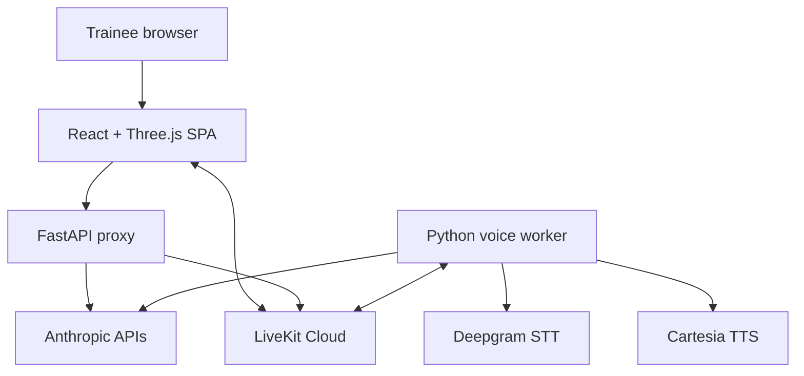

# Architecture

## Actual style

MedSim is a client-heavy, three-process client/server application. The frontend is a feature-oriented React SPA with one imperative in-memory game store and one authentication context. The FastAPI backend is the security boundary and API proxy, with an isolated SQLite repository for accounts, sessions, and owned encounter summaries. Real-time voice runs as a separate LiveKit Agents worker. Static TypeScript modules form the clinical knowledge layer.

`backend/auth_system.py` provides the SQLite repository, migration runner, Argon2id authentication service, cookie-session endpoints, and owned progress endpoints. There is no ORM, background-job queue, third-party authentication provider, or microservice mesh.

## Frontend

- Entry: `src/main.tsx`; clears persisted conversation keys and mounts `App` under React Strict Mode.
- Navigation: `src/App.tsx` conditionally renders one screen based on `GameState.screen`. Only `/agentic-rounds` and `/agent-topology` have pathname deep links; there is no routing library.
- State: singleton `Store` in `src/game/store.ts`, exposed through `useSyncExternalStore`. State is shallow-replaced; patient mutations clone nested objects.
- Domain contracts: `src/game/types.ts`; specialty IDs: `src/game/clinic.ts`.
- UI: screen components under `src/components`; shared illustrated primitives in `primitives.tsx`; the active room is `components/three/Polyclinic.tsx`.
- Clinical data: static TypeScript arrays/maps in `src/data`.
- AI client: `src/agents/*` for Managed Agent debrief; `src/voice/*` for LiveKit and typed patient chat.
- Persistence: SQLite for accounts, hashed server sessions, and authenticated evaluations; `localStorage` for onboarding, music, conversation keys, and identity-namespaced guest evaluations. Legacy `gr_eval_history` is retained but not imported.

## Backend

`backend/server.py` combines configuration loading, security middleware, schemas, prompts, agent bootstrap/versioning, session proxying, SSE, fake EHR data, patient text streaming, and LiveKit token/room creation. It is a pragmatic hackathon monolith rather than a layered backend.

The app loads `backend/.env.local` without overwriting non-empty process variables. Middleware order is CORS → SlowAPI → shared-secret check. `/health` is public; localhost-looking Origin/Referer values bypass the shared secret; other protected requests require `x-medsim-auth` when configured.

`backend/voice_agent.py` is an independent worker. It reads persona data from LiveKit room metadata and composes Deepgram Nova-3, Claude Haiku 4.5, Cartesia Sonic-2, and Silero VAD. It implements an RPC farewell and deterministic voice selection.

## Main dependency boundaries

- `PatientCase` IDs link cases, tests, treatments, medications, imaging examples, guidelines, and evaluations. These string relationships are not enforced by a database.
- Backend custom-tool JSON schemas must match frontend Zod schemas manually.
- `POLYCLINIC_BED_INDEX = -10` is a cross-module sentinel shared by store, scene, and conversation cache.
- Agent prompt contracts must match `DebriefRequest` and `CaseEvaluationInput`.
- LiveKit metadata field names must match between `conversation.ts`, `/voice/token`, and `voice_agent.py`.

## Architectural discrepancies

- Historical planning documents may reference prototype files that no longer exist; current runtime documentation is outpatient-only.
- Spec says one Managed-Agent session per shift; current debrief hook creates one session per debrief.
- System prompt says the debrief includes voice transcript/free-text counselling; the request type and builder include neither.
- README says the frontend can work without the voice worker because text chat remains; `Conversation.init()` failure can prevent the cached conversation from reaching `ready`, so the visible fallback behavior is not fully guaranteed.
