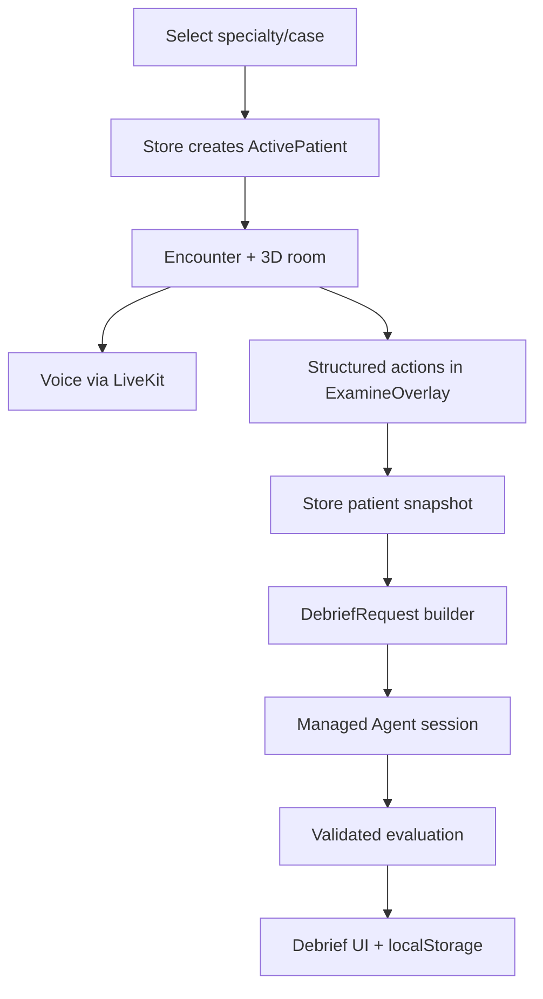
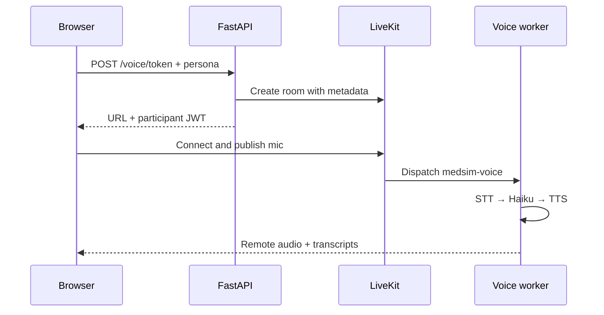

# Data Flow

## Outpatient encounter

1. `POLYCLINIC_CASES` is flattened by `src/data/cases.ts`; the synthetic `all-specialties` bucket is skipped to avoid duplicates.
2. `Store.acceptNextPatient()` converts the selected catalogue card back to its full `PatientCase`, creates `ActivePatient`, pre-warms Web Audio, marks the case attempted for this page session, and navigates to `encounter`.
3. `EncounterScreen` mounts `Polyclinic`, `Player`, and `FloatingVoicePanel`. Structured actions call Store mutators; all outpatient tests complete immediately.
4. Dispatch snapshots the active patient to `lastEncounter`, clears the live patient, disposes the conversation, and either loads another patient or navigates to the wrap screen.
5. `DebriefScreen` builds a request from `lastEncounter`, starts a Managed Agent session, validates `render_case_evaluation`, renders it, and saves it to `gr_eval_history`.

## Voice lifecycle

`patientPersona.ts` deterministically builds adult/parent prompts from static case data. The entire prompt is passed through the browser to FastAPI, placed in room metadata, then trusted by the worker. Live final transcription segments are appended to the conversation cache and `localStorage`. They are displayed in the chat tab but are not copied into `ActivePatient` or the debrief request.

Typed chat uses `/agent/patient/stream`, with the same system prompt and accumulated `ChatMessage[]`, and receives SSE text deltas from Haiku.

## Debrief lifecycle

1. `buildDebriefRequest()` selects the authored rubric or calls `deriveAutoRubric()`.
2. It builds a guideline registry slice from rubric references, structured history-question IDs, test IDs/timestamps/results, treatment IDs, prescriptions, and submitted diagnosis.
3. `useAttendingDebrief()` calls `/agent/bootstrap`, creates a fresh session, opens the SSE stream, then sends the request as a `user.message`.
4. Backend proxies events to Anthropic. The agent is instructed to emit one `render_case_evaluation` call.
5. Frontend Zod-validates the payload, acknowledges the tool call, and stores the result locally.

## Missing data paths

- Voice and typed-chat transcript are not included in the debrief payload.
- `EndConfirmChecks` are not included in the debrief payload, despite UI text saying they affect the debrief.
- Polyclinic has no Store action that adds `givenTreatmentIds`; only prescriptions are mutable.
- `gradePrescription()` is never called, so its deterministic indication/contraindication score does not affect the visible grade.
- The triage API has no frontend caller.
- No encounter or evaluation is persisted server-side.
