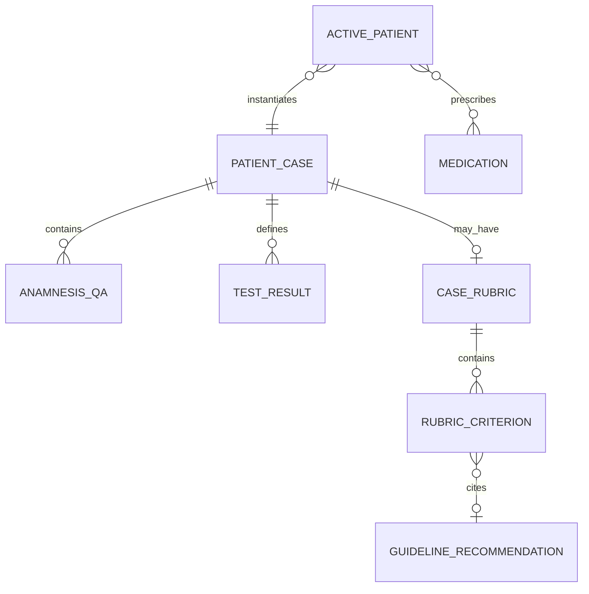

# Medical, Clinical, and Grading System (archived pre-local-AI audit)

> Historical snapshot only. See `docs/local-ai-architecture.md` for current evaluation boundaries.

## Clinical knowledge architecture

The clinical layer is a hybrid of manually authored static data and LLM interpretation:

- Case facts, vitals, questions/answers, test results, diagnosis options, acceptable/critical treatment IDs, medication indications/contraindications, and guideline records are hard-coded TypeScript.
- Data-integrity scripts deterministically validate IDs and a few invariants, not medical correctness.
- Patient dialogue is generative, conditioned on static case data.
- Debrief scoring is LLM-generated against a static rubric; only the fallback rubric construction and evidence serialization are deterministic.
- The deterministic prescription grader exists but is not used by the active workflow.

No clinical content should be treated as clinician-verified. All three guideline entries are marked `auto-fetched`; there are no `verified` entries. Most case content has no validation metadata at all.

## Entities and relationships



Relationships use string IDs rather than database foreign keys. `PatientCase.correctDiagnosisId` and `diagnosisOptions` connect cases to medication indication lists; test/treatment IDs connect to catalogue arrays; guideline references use `guidelineId:recId`.

## Data inventory

- 240 outpatient cases across 24 specialties.
- 225 distinct correct outpatient diagnosis IDs.
- 80 tests, 49 panels, 19 shared treatment/disposition definitions, 107 medications.
- 3 NICE guidelines and 22 recommendations, all auto-fetched.
- 3 authored rubrics (`im-003`, `im-004`, `im-005`); 237 auto-derived rubrics.
- Outpatient severity labels preserve routine, urgent, and critical-escalation teaching semantics.

## Encounter/evaluation pipeline

```text
PatientCase
→ displayed facts + generative persona
→ manual history-question IDs, test IDs, diagnosis ID, prescription records
→ ActivePatient snapshot
→ rubric + cited guideline slice + structured action log
→ Opus Managed Agent
→ Zod-validated criterion results/domain scores/global rating
→ debrief and browser history
```

### Rubric rules

Three domains are modeled: data gathering, clinical management, and interpersonal. Criteria have weights 1–3. The system prompt directs the model to award 1.0× weight for met, 0.5× for partially met, and 0 for missed. Verdict thresholds are ≥0.85 excellent, ≥0.70 good, ≥0.55 satisfactory, ≥0.40 borderline, else clear-fail. Zod validates shape, but the frontend does **not** recompute raw/max scores, threshold bands, criterion completeness, case ID, or guideline allowlist compliance.

Authored clinical-management criteria may cite `guidelineId:recId`. `collectRegistrySlice()` sends only those recommendations. The UI resolves citations against the full local registry. Auto-rubrics deliberately have no citations.

### Critical scoring limitations

1. The request omits the voice/text transcript and closing-checklist answers. Interpersonal and safety-netting judgments therefore lack the claimed evidence.
2. Voice questions do not mark matching `askedQuestionIds`; the structured history buttons are the only source of data-gathering credit.
3. Polyclinic records prescriptions but never `givenTreatmentIds`; fallback clinical-management criteria are based on `criticalTreatmentIds`, so the action vocabulary does not align.
4. Dose and duration are free-form and are not validated or scored.
5. `gradePrescription()` uses diagnosis ID membership, awards +30 per indicated medicine (cap +60), −20 per explicit contraindication, and −5 per unrelated/unknown medicine, but has no callers.
6. Diagnosis scoring is exact string equality. Alternative reasonable diagnoses cannot receive deterministic partial credit.
7. Tests are recorded as ordered, but no explicit rubric logic scores unnecessary tests or context/severity unless the LLM infers it from criterion text.
8. The wrap-up checklist says it affects the debrief, but it is neither logged nor reset per encounter.
9. A debrief can be requested without a diagnosis even though the agent prompt says never evaluate before diagnosis.
10. A saved no-diagnosis encounter is labeled with the correct diagnosis fallback if an evaluation somehow arrives.

## Medical-safety status

| Subsystem | Technical state | Clinical validation state |
| --- | --- | --- |
| Cases | Structurally verified IDs | Needs physician review |
| Tests/results | Static and internally linked | Needs physician/lab/radiology review |
| Medications/doses | Static catalogue; ID integrity checked | Needs pharmacist/physician review |
| Indications/contraindications | Deterministic lists | Needs specialty review; incomplete lists must not imply safety |
| Guidelines | Citation references resolve | Auto-fetched, not clinician-verified |
| Rubrics | 3 authored, 243 generated from case fields | Needs assessor validation and fairness testing |
| Debrief | Structured output validated | LLM-dependent and evidence-incomplete |

## Required clinical governance before real use

- Define named clinical owners and review status/date/version for every case, medication rule, rubric, and guideline.
- Validate cases against the intended country, learner level, and current guideline edition.
- Separate educational simplification from unsafe omission.
- Add multiple-acceptable-answer semantics and contraindication context (allergies, pregnancy, renal/hepatic function, interactions, dose).
- Test inter-rater reliability against clinician graders and audit demographic bias.
- Prevent deployment language from claiming accuracy until evidence supports it.
